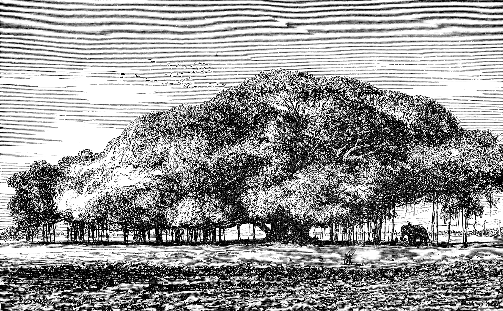

= banyan
:docinfo: shared

== The name

.A great banyan tree at Calcutta. Adapted from <<Bal89>>.

[quote, Sabine Baring-Gould, '<<Bar81>>']
The Hindu story of the confusion of tongues and the separation of nations is not connected with the erection of a tower, but with the pride of the Tree of Knowledge, or the world tree. This tree grew in the centre of the earth, and its head was in heaven. It said in its heart, I shall hold my head in heaven, and spread my branches over all the earth, and gather all men together under my shadow and protect them, and prevent them from separating. But Brahm, to punish the pride of the tree, cut off its branches and cast them down on the earth, where they sprang up as Wata trees, and made differences of belief and speech and customs to prevail in the earth, to disperse men over its surface.
footnote:[This myth is described in link:#Sch05[Sch05] but details about the species are omitted. The article references the paragraph we quoted from link:#Bar81[Bar81], which in turn seems to be the earliest English translation of link:#Mul22[Mul22]. In this last source we read "[.Fraktur]#Die zerschlagenen Aeste wurden nun weit in der Welt umhergepflanzt, und einundzwanzig Watabäume wurden daraus#" which translates to "The broken branches were then scattered all over the world, and twenty-one Wata trees grew out of them".]

_Banyan tree_ and _wata tree_ -- from the sanskrit वट वृक्ष (link:https://en.wikipedia.org/wiki/Help:IPA/Sanskrit[/ʋɐʈɐ ʋr̩kʂɐ/], link:https://en.wikipedia.org/wiki/International_Alphabet_of_Sanskrit_Transliteration[vaṭa vṛkṣa]) -- are common names of the link:https://en.wikipedia.org/wiki/Ficus_benghalensis[Ficus benghalensis], the sacred national tree of India.

Banyans are the largest trees in the world by canopy coverage, exceeding 19000m^2^.
Alexander's general Nearchos described thousands of men taking shelter beneath one.
In the shade of another one, Kassapa Buddha found enlightenment.

== The project

CAUTION: The seed is planted and growing.

Click to read the Jupyter notebooks with an online viewer:

* link:https://nbviewer.jupyter.org/github/paolobrasolin/banyan/blob/main/v0.ipynb[banyan v0]
* link:https://nbviewer.jupyter.org/github/paolobrasolin/banyan/blob/main/v1.ipynb[banyan v1]

[bibliography]
== References

* [[[Bal89]]]
  Maturin Murray Ballou.
  link:https://archive.org/details/footprintsoftrav01ball/page/n146/mode/1up[_Foot-prints of travel or, Journeyings in many lands_, p.146].
  Boston, Ginn & company. 1889.
// https://www.flickr.com/photos/internetarchivebookimages/14797751953/in/photostream/?view=theater

* [[[Bar81]]]
  Sabine Baring-Gould.
  link:https://www.gutenberg.org/files/48736/48736-h/48736-h.htm#Page_148[_Legends of the Patriarchs and Prophets and Other Old Testament Characters from Various Sources_, p.148].
  American Book Exchange. 1881.
  

* [[[Sch05]]]
  Harold Scheub.
  "Myths about Language: Reaching to Heaven", _Encyclopedia of Language and Linguistics_.
  Elsevier. 2005.

* [[[Mul22]]]
  Niklas Müller.
  link:https://books.google.it/books?id=bM-1AAAAIAAJ&pg=PA303[_Glauben, Wissen Und Kunst Der Alten Hindus in Ursprünglicher Gestalt Und Im Gewande Der Symbolik_, Volume 1, p.303].
  Bei F. Kupferberg. 1822.
  
